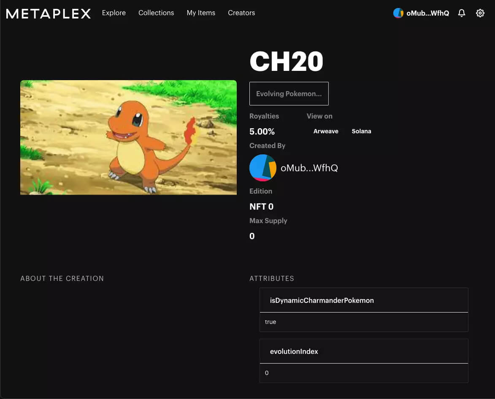
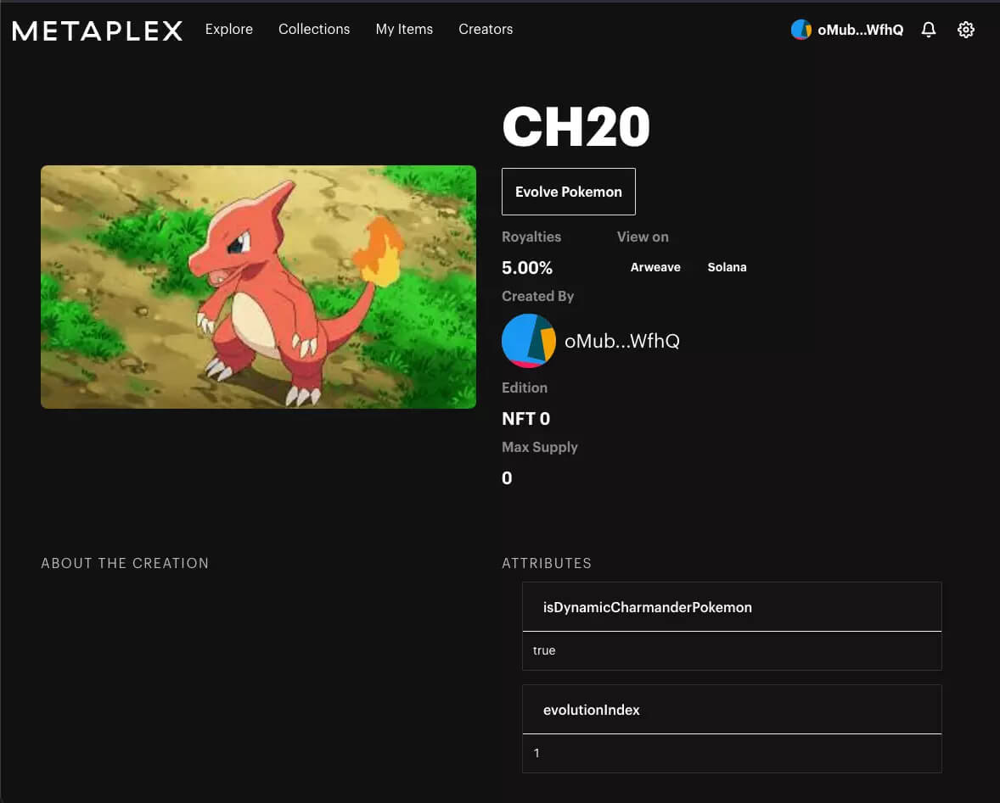
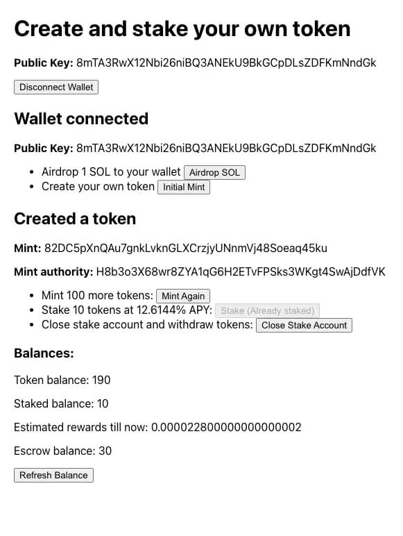

I love exploring new programming languages and I have been trying to learn Rust for a good 2-3
months now. I learned about Solana during this time. I started diving deeper into the web3
ecosystem, bought some SOL, created a wallet, started using some Solana apps and read a lot.

Looking back, I feel Solana spoiled me. I expected all blockchains to be fast and have great
wallets like [Phantom](https://phantom.app/). I tried Ethereum next, and the experience was
significantly worse. I was paying \$80 gas fees and waiting for transactions to complete, and
Metamask wasn't very intuitive. Solana and products in its ecosystem were the only ones I looked
forward to using.

## Getting into the fellowship

After all this experimentation, I wanted to work full-time in web3 and see what was possible with
this new technology stack. Around this time, I came to know about the fellowship on
[SuperteamDAO's](https://twitter.com/SuperteamDAO) Twitter.

Superteam is a collective which helps the most promising projects in the Solana ecosystem in the
ascending world (India, South East Asia, Eastern Europe, and Africa) launch and grow. I had been
following Superteam for a while, particularly their
[podcasts](https://www.youtube.com/channel/UCi-pkXLbm7sqXFhV1NBLUfQ).

The [fellowship](https://solana-india-fellowship.devfolio.co/) looked exciting. It was an 8-week
program to learn about Solana and build apps for it. There is a new theme each week, from NFTs to
DeFi to Gaming, followed by quests, exercises, and Q\&A sessions by experts. And you get a \$2500
stipend!

The fellowship aligned with my goals, so I applied. I had to fill out a few application forms and
give an in-person interview. After a week, I got an email from them welcoming me to the fellowship.
Yay! I was excited to dive deeper and learn from a fantastic team of mentors and supporters.

---

If you have any questions about the fellowship, feel free to reach out to me on
[email](mailto:g10pahal@gmail.com) or [X](https://x.com/g10pahal).

## Week 1: Getting Started

The first week's goal was to brush up on Rust concepts, Solana's programming model and tooling.

### Solana ecosystem and the fellowship

The week started with a talk by [Chase](https://twitter.com/therealchaseeb), who works at Solana in
developer relations. He talked about the Solana ecosystem, its growth over the last year,
especially in India and where he sees it going. There is a lot to be optimistic and excited about!
Do follow him to keep up with the ecosystem and learn how to get started with Solana. Also, check
out [SOL dev\_](https://soldev.app/) for everything you might need for developing on Solana.

Then, we got to know more about the fellowship, its structure and goals from
[Neil](https://twitter.com/neilshroff) and [Gnana Lakshmi](https://twitter.com/gyanlakshmi).

### Rust

I knew some Rust before starting the fellowship. I like learning new languages, and Rust was the
one I chose to learn last year. Like most resolutions, it wasn't very successful. But I ended up
using it in a small side project and also got to know about Solana.

I spent the 2 weeks refreshing my Rust knowledge. I enjoyed going over exercises on
[Rustlings](https://github.com/rust-lang/rustlings) and
[Exercism](https://exercism.org/tracks/rust). They both have short, progressively tricky exercises
you can easily do on your local machine. Simple and engaging. If anyone prefers video, have a look
at these:
[Rust Programming Tutorials](https://www.youtube.com/playlist?list=PLVvjrrRCBy2JSHf9tGxGKJ-bYAN_uDCUL)
and
[Introduction to Rust for Solana](https://questb.uk/quest/introduction-to-rust-for-solana-3b5a).

### Solana

The previous week, I read
[Explaining Solana with The Simpsons](https://learn.figment.io/tutorials/explaining-solana-with-the-simpsons).
It's one of the best introductions to Solana I have come across to date. It talks about Solana and
its unique innovations. I had previously gone through the official blog posts written by Solana
developers to understand why it's so fast and secure. But they were dense and a bit difficult for
me to understand. But after reading the Simpsons post, it started to make sense. Kudos to
[Jonathan Ferreira](https://twitter.com/JSoufer) for putting it together.

This week was about learning the
[programming model](https://docs.solana.com/developing/programming-model/overview),
[how to deploy to Solana](https://openquest.xyz/quest/deploying-the-program-on-to-solana) and
[how to work with interfaces to Solana like the spl token cli](https://openquest.xyz/quest/create_crypto_with_solana_cli).
It was a fun experience to actually use the technologies that I had read about, to experience them,
and to see how they worked.

## Week 2: Creating mini dApps

This week's goal was to start creating mini dApps on Solana. There are 2 parts to this -
interacting with Solana using [`@solana/web3.js`](https://solana-labs.github.io/solana-web3.js/)
library and creating on-chain programs.

### Thoughts on web2 vs web3 development

[Preethi Kasireddy](https://twitter.com/iam_preethi) discussed how web3 development differs from
the classical client-server programming model. On the one hand, web3 makes it extremely simple to
have a global computer with persistent storage, but on the other hand, doing iterative development
is significantly more difficult. Another significant difference is the security model and how much
auditing needs to be done before deployment. Because iterative upgrades are complex, auditing and
security reviews must be done before deployment.

My experience so far with Solana and Ethereum aligns with that: a lot of the basic concepts are the
same - you are still writing rust/solidity/js, storing/retrieving data, using a database as a
source of truth - but things change a lot when you start building, deploying, combining these
components. Be sure to have an open mind if you want to go deep.

### Solana web3.js library

This week, we did two quests -
[creating an airdrop program](https://openquest.xyz/quest/create-an-airdrop-program-with-solana-web3.js)
and [creating a roulette game](https://openquest.xyz/quest/roulette_game_in_solana). Both of them
were about how to use [`@solana/web3.js`](https://solana-labs.github.io/solana-web3.js/) to
interact with Solana and on-chain programs. The quests are relatively easy if you know JavaScript.

My quick review of the library - very easy to use, powerful (you can move real money in a couple of
lines of code), and even better with Typescript with all the autocompletion goodness.

### On-chain voting program

We had to build a voting program with support for delegation
([same thing implemented in Solidity](https://docs.soliditylang.org/en/v0.8.11/solidity-by-example.html)).
I wanted to do this exercise without using the
[Anchor framework](https://github.com/project-serum/anchor). Even though it makes program
development much simpler and more secure, it abstracts away quite a few things. I wanted to learn
how the Solana program SDK handles those things without the Anchor abstractions.

It turned out to be more challenging than I expected. I couldn't find a good starting point, so I
went into a rabbit hole and explored the Solana program library. I found the
[`name-service`](https://github.com/solana-labs/solana-program-library/tree/master/name-service)
program most helpful. Its features were relatively straightforward, and the implementation was
simple to understand. I created a template for myself at
[templates/program](../programs/templates/program).

I completed the program after browsing and going through open-source Solana and Rust programs. I
could not test it through a UI, so I learned how to write integration tests for Solana. It was
satisfying to see the green check marks after some challenging work.

That said, I'll be using the Anchor framework from now on. Not using it showed me how useful it is.

## Week 3: More dApps

This week's goal was to continue creating dApps on Solana - not as simple as last week's.

### Anchor framework

This week, I had a personal goal - to learn and use the
[Anchor framework](https://github.com/project-serum/anchor). Anchor provides an eDSL for writing
Solana programs and IDL that anyone can use to generate a client. It also comes with a CLI and
workspace management for developing applications.

I faced a lot of issues last week getting started with Solana programs. There is too little
documentation and quite a bit of boilerplate. Looking at open-source programs helped me immensely,
especially [`solana-program-library`](https://github.com/solana-labs/solana-program-library).

I had heard great things about Anchor, so I used it for this week's work. And it was great. It was
easy to follow the tutorials, go through [The Anchor Book](https://book.anchor-lang.com/), start a
new project and get the program to a working state. It makes Solana development feel as simple as
Solidity development. The only problem I faced was the limited documentation, which was expected
given that it's a young project and is under active development.

### On-chain programs

This week, we did three quests -
[building a crowdfunding platform](https://openquest.xyz/quest/building-a-crowdfunding-platform-using-solana),
[setting up campaign accounts and sending money](https://openquest.xyz/quest/setting-up-campaign-accounts-and-sending-money-on-solana)
and [creating an on-chain calculator](https://openquest.xyz/quest/solana-calculator). These were
easy to follow after last week's exercise. The calculator program was also a good introduction to
using the Anchor framework.

This week's exercise was to build a bi-directional payment channel
([same thing implemented in Solidity](https://solidity-by-example.org/app/bi-directional-payment-channel/)).
It was a challenging exercise, just like the last one, but for different reasons.

The programming models of Ethereum and Solana are very different. So, directly copying over the
logic is not possible. Where you can store data, where you hold the treasury, how you manage the
treasury - all of these things have to be handled differently on Solana.

There were many instances when I thought I was done with the program logic, just to be hit with
another error and learn something new about the Solana programming model. I completed it after a
day of work. What was helpful was that I wrote some basic tests beforehand. So, the build and test
cycle was tight.

Some final thoughts: Anchor is awesome; be ready to go into rabbit holes, as the documentation and
example programs are limited, test continuously, and error messages are sometimes unclear. Join the
Anchor and Solana Discords to get help.

## Week 4: NFTs

This week was about NFTs—what they are, when they can be used, and how to create some on Solana.

### Creator ecosystem

We had a session by [Jenil](https://twitter.com/0xjenil) from [Coinvise](https://www.coinvise.co/)
at the start of the week. He talked about communities, NFTs, tokens, DAOs, and web3. It was an
insightful session, with some interesting anecdotes from his journey. Jenil also discussed how to
evaluate and build ideas, specifically in web3. The way early projects and communities originate
and operate is very different from web2 companies. I needed to think about it in the coming weeks
as the project deadline comes closer.

### NFTs

This week, we did two quests -
[creating and burning NFTs using `@solana/web3.js`](https://openquest.xyz/quest/create-burn-nft-solana)
and
[creating your own NFT minting machine](https://openquest.xyz/quest/create_a_candy_machine_minting_nft_and_minting_website_v2).
I particularly enjoyed the second one. It allowed me to deploy an NFT minting machine quickly, and
then I could peek inside the code and see what was happening.

I had previous experience creating NFTs on Ethereum. The mental model of Solidity was much more
straightforward. There were a couple of interfaces - ERC-721 and ERC-1155 - implement those, go as
crazy as you want with the implementation, and you are done.

Metaplex is the de facto NFT standard on Solana. It is significantly more complex than the Ethereum
standards. Some of it is because of Solana's programming model, and some of it is to be fast. The
good thing is that Metaplex has excellent tooling, documentation, and UI code to get you started. I
leaned on that to understand Solana's NFTs and do the exercise.

### Dynamic NFTs

This week's exercise was to create an NFT marketplace supporting dynamic NFTs. I decided to build
dynamic Pokemon NFTs. You start with Charmander Pokemon and can evolve it into Charmeleon,
Charizard, etc.

I bootstrapped with [Metaplex Storefront](https://docs.metaplex.com/storefront/introduction) and
added UI components to create and evolve Pokemon NFTs. The creator could go to the Pokemon NFT page
and click a button to evolve it. Learning about the Metaplex APIs and the Metaplex Storefront UI
cache management was the most challenging part.

It was not the best solution, though. Right now, the dynamic nature requires the creator to
manually update the metadata by clicking a button. Ideally, there should be an on-chain program as
the NFT's update authority. That program would be responsible for checking the conditions for
evolution and automatically evolving the NFT based on conditions like time passed, etc. But I
didn't have enough time to implement that, unfortunately! It's a nice addon that I may implement at
some point.

## Week 5: DeFi

We focused on DeFi this week - basics of tokens, staking, and tokenomics.

### DAO treasuries and getting into web3

This week we had a session by [Shreyas](https://twitter.com/HelloShreyas), who's the co-founder of
[Llama](https://llama.xyz/). He talked about economic infrastructure for DAO treasuries, how to
create a community, his journey in web3 and how important it is to have a good name for your
product!

I connected a lot with his journey into web3 - he left his job wanting to get into a new industry
and took part in hackathons to force himself to do something - something I am trying to do. Another
interesting thing he talked about was how to decide what problems to work on - he helped people
with their DAOs, and that's where he came across the problem people face managing treasuries. Since
then, he has built a product, created a community around it and built up conviction in the problem
statement.

### Creating my own wallet and cryptocurrency

To see how Defi is implemented on Solana, we did 3 quests -
[creating a wallet](https://openquest.xyz/quest/create_personal_wallet),
[creating your own crypto using solana programs](https://openquest.xyz/quest/solana-my-money) and
[creating your own crypto using javascript](https://openquest.xyz/quest/create_crypto_with_js). All
of these were focused on how to move money, SOL or any other SPL token.

The first 2 interacted with Solana through its JSON RPC API, but the last one was interesting - we
had to create a Solana contract that proxies calls to the main SPL token program. This ability to
call other programs quickly makes the ecosystem more composable and rich.

### Staking and Tokenomics

The exercise for this week was to add support for staking to the cryptocurrency created in one of
the quests. This is what I ended up making.

I had to consider where to escrow the funds, how to create different escrow accounts for tokens,
and how to connect it all in the UI to provide a good user experience. It was a fun exercise, and
I ended up learning a lot.

This exercise also made me think about token economics (tokenomics for short). Different projects
have different ways of token distribution, inflation, rewards, etc. I wanted to know why different
projects choose different mechanics and how they implement those.

I read the documentation of [Solana economics](https://docs.solana.com/economics_overview). It is
a well-written set of articles. I would suggest everyone go through them to know why people stake
and why it's beneficial for the blockchain that people distribute their stake to different
validators - a problem some projects are trying to solve.

## Week 6: More Complex dApps

This week, there was no particular theme; we just practised, built more complicated programs, and
started on the fellowship project.

### dApps, dApps everywhere...

There were 4 guided quests - all very different.

- [**Staking on Solana:**](https://openquest.xyz/quest/staking-solana) This talked about staking
  and how you can stake on Solana. I have been staking on Solana for the past year, and this was an
  excellent deep dive into how it works under the hood.

- [**Building a messaging app on Solana:**](https://openquest.xyz/quest/solana-messaging-app) This
  was a quest to create a simple messaging contract and write tests for it.

- [**Building a decentralized identity verification system on Solana:**](https://alexgrinman.com/posts/building-decentralized-identity-verification-system-on-solana/)
  Decentralized identity verification is an interesting problem, and blockchains are an excellent
  implementation tool. You should try this quest if you've used ENS (.eth domains) or Bonfida
  (.sol domains). It will give you an idea of how to implement services like that.

- [**Building a blog on Solana:**](https://learn.figment.io/tutorials/build-a-blog-dapp-using-anchor)
  This one was similar to the messaging app. But the good thing was that the author provided a UI
  that I could use to play with the app.

The exercise for this week was to create a shared wallet between friends to spend from. The program
I built allowed a group of people to create a shared wallet that they could use to manage any SPL
token. I used the proxying technique from the previous week to create a proxy spl token. For now,
the shared wallet only allows the transfer of SPL tokens. It can be extended to any transaction
type in the future, similar to multi-sig wallets like Goki.

### Fellowship project

For my fellowship project, I decided to work on streaming payments for Solana.

#### The problem

The original idea that I came into the fellowship with:

> Having worked at private remote companies, I have seen people having issues with ESOPs
> (transparency and illiquidity), global payroll and expense management.
>
> This is something I feel blockchain technology can solve, especially for newer-generation
> companies which are global, distributed, and they want new structures for incentivization and a
> seamless employee experience.

At the same time, startups are coming up in India and overseas that are trying to solve for earned
wage access. Earned wage access means employees can access their earned wage anytime. For example,
a person with a salary of 30k per month can withdraw \~15k on the 15th of that month rather than
waiting for the start of the following month.

Low-income employees want this because they sometimes face cash crushes at the end of the month if
there is any sudden financial expense. They have to resort to predatory loans in these
circumstances.

#### The Solution

I used Superfluid when I was trying to build something on Ethereum. Thinking about these problems
made me think of it and how easy it would be to build solutions on top of it that can solve the
issues mentioned above.

The idea was to have a contract that allows a sender to send streaming payments to a recipient.
Some features that I need for this contract:

- **Support for cliffs:** ESOPs generally involve cliffs, so we need some way to codify cliffs to
  support that use case.

- **Prepaid and Unbounded streams:** Some stream types, like ESOPs, would need to be prepaid because
  employees would need assurance that part of their tokens are locked up in an escrow that will be
  given to them on the vesting schedule. Other streams like payroll and subscriptions will be
  unbounded, so senders can top up the escrow to keep them running.

- **Solvency detection:** Unbounded streams may become insolvent if not topped up in time. There
  needs to be a way to identify them as quickly as possible and penalize the sender of that stream
  somehow. Superfluid uses deposits and sentinels to incentivize this behaviour. Something similar
  would be needed here.

There are solutions in the Solana ecosystem that are trying to bring streaming payments to Solana.
However, these lack some features needed to solve the use cases. Some of these are closed-source,
so it isn't easy to gauge if they can add these features in an update.

## Week 7: Starting on my project

This week, I designed and started implementing the project idea. I made significant progress,
finalized the scope, and implemented major parts of the smart contract.

### Components

There would be 4 main components:

- Streaming contract
- Service that checks for insolvent streams
- Javascript client for usage in browser/node applications
- Web UI for users to manage their streams

One of the main aims I have for the project is that any other project should be able to hook into
these components to incorporate payment streaming.

Another exciting aspect of the project is insolvency - how to detect, decentralize, and incentivize
people to prevent it. I have some ideas on this subject but am still finalizing the approach.

### Naming the project

Probably the most difficult decision of this week. I didn't spend a decent amount of time thinking
about it. I finalized on **Superstream**, inspired by Superteam.

### Future considerations

Many more exciting things can be done. One example is transitive streams. If Alice is streaming to
Bob and Bob is streaming to Charles - Charles can be assured that his stream will not go insolvent
till Alice is topping up the stream. The contract can ensure that Bob only takes out the net
balance from both streams.

However, implementing these ideas is pretty complex and out of scope for the project. I might come
back to these ideas later.

### Tech stack

- Smart contract implemented in the excellent [Anchor framework](https://book.anchor-lang.com/)
- Insolvency checker and javascript client using Typescript
- Web UI using [Next.js](https://nextjs.org/) and Typescript

## Superstream

It took me a month, but the project is finally ready. It's live at
[superstream.finance](https://superstream.finance/). Try it out, and let me know what you think!

## Closing thoughts

It was a fun and productive 8 weeks. I learned a lot, built a lot of things and got to know a lot
of people. I'm excited to continue building on Solana. I would recommend it to anyone who wants to
learn how to delevop Solana apps.

I'm especially pleased about this project. I plan to dedicate some time to market it and build a
community around it.
